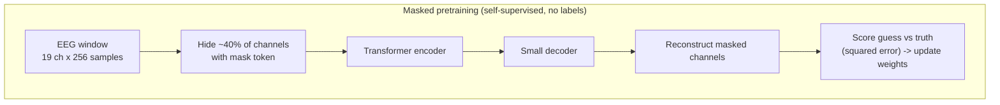
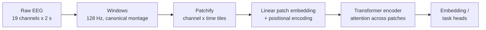
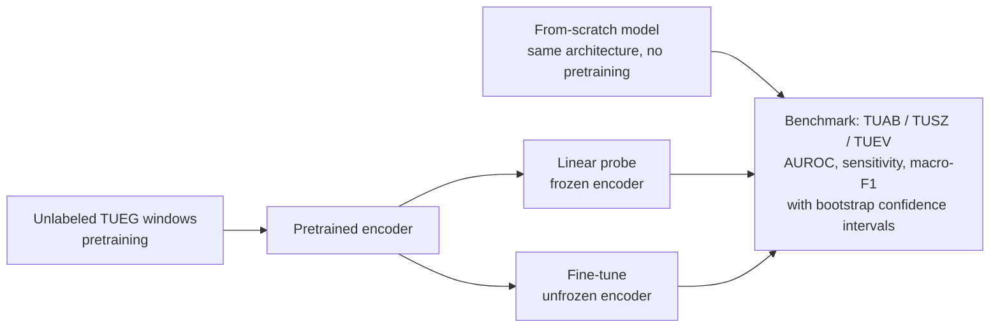
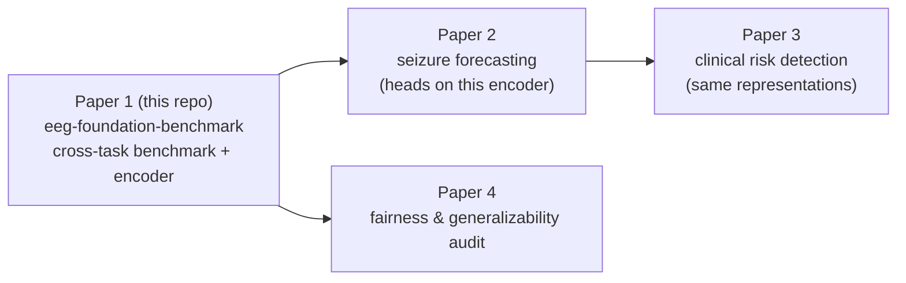

# Extended Introduction: EEG and Foundation Models, Built Up From Scratch

**Who this is for:** anyone — no neuroscience, no signal processing, no
machine-learning background assumed. Every idea below is first shown on a
tiny concrete example you can verify with pencil and paper, then explained
in plain words, and only then given its technical name as a shorthand.
This is a companion to the more technical
[Introduction](INTRODUCTION.md), which holds the formal background,
research questions, and the references cited in brackets below.

**Concept figure:** the pipeline of this repo — raw clinical EEG →
preprocessing → self-supervised transformer encoder → TUAB/TUSZ/TUEV tasks
under one benchmark harness — rendered faithfully in Mermaid at
[figures/concept_figure.md](figures/concept_figure.md). *(A publication-style
PNG was generated but could not be committed with the current text-only
tooling; the Mermaid figure depicts the identical pipeline.)*

---

## Step 0: A wiggly line of eight numbers

Forget brains for a moment. Here is a complete "signal":

```
time:    1   2   3   4   5   6   7   8
value:   0   3   0  -3   0   3   0  -3
```

Plot those eight numbers as dots and connect them, and you get a little
wiggle: up, down, up, down. That is everything a signal *is* — a list of
numbers, one per moment in time. An EEG recording is exactly this, except
the list is longer (hundreds of numbers per second) and there are several
lists at once, one per electrode glued to the scalp.

Three things you can do with any wiggly line, shown on our eight numbers:

1. **How fast does it wiggle?** Our line repeats its up-down pattern
   every 4 steps (0, 3, 0, −3, then again). If the 8 steps span one
   second, the pattern repeats twice per second. *"Repeats per second"*
   is all the word **frequency** means, and its unit, "per second", is
   called **Hertz (Hz)**. Our toy signal is a 2 Hz wiggle.
2. **Where in the cycle are we?** A wiggle has phases of its journey:
   climbing (step 1→2), falling (step 2→4), climbing again. Saying "the
   two channels reach their peak at the same moment" versus "one peaks
   while the other bottoms out" is all the word **phase** means. Phase
   is just "where in the wiggle-cycle," like where the hour hand is on
   a clock.
3. **Keep the slow wiggle, drop the fast jitter.** Suppose our line had
   instead been `0, 3.2, -0.1, -3.1, 0.2, 2.9, -0.2, -2.8` — the same
   slow wiggle plus small jitter. Averaging neighbors smooths the jitter
   away and keeps the slow wiggle. That smoothing is the simplest case
   of what engineers call **filtering**: a recipe for keeping the wiggle
   speeds you care about and suppressing the rest. Nothing more mystical
   than weighted averaging, done systematically.

That is the entire signal-processing vocabulary this project needs:
frequency (how fast), phase (where in the cycle), filtering (keep some
speeds, drop others).

## Step 1: What EEG actually is

Your brain runs on electricity. When large groups of neurons fire in
rhythm together, their combined electrical field leaks through the skull
and can be picked up by small metal discs (electrodes) on the scalp.
**Electroencephalography (EEG)** is the act of recording those voltages
over time — typically 19–25 electrodes, each producing one wiggly line
sampled hundreds of times per second.

A useful analogy: **EEG is like listening to a stadium crowd from outside
the stadium.** You can't hear individual fans (single neurons), but you
can hear the crowd roar, go quiet, or chant in rhythm. A trained listener
learns a lot about the game from those collective patterns — and a trained
neurologist, or a computer model, learns a lot about the brain.

Brains produce rhythms at characteristic speeds, and using Step 0's
vocabulary we can name them:

| Band | Frequency | Plain-English meaning |
|---|---|---|
| **Delta** (0.5–4 Hz) | slowest wiggles | Deep sleep; large slow swells. |
| **Theta** (4–8 Hz) | slow | Drowsiness, daydreaming. |
| **Alpha** (8–13 Hz) | medium | Relaxed wakefulness — close your eyes and alpha appears at the back of the head; open them and it vanishes. (Our public demo classifies exactly this!) |
| **Beta** (13–30 Hz) | fast | Alert, focused thinking. |

A **seizure** is an electrical storm: neurons start firing together in an
abnormally strong, self-sustaining rhythm. On paper it looks like rhythmic
spikes or waves that grow, evolve, and spread across electrodes over tens
of seconds — visibly different from the background, which is why a machine
might learn to spot it.

## Step 2: Why this needs automating

- **Experts are scarce.** Reading EEGs takes years of fellowship
  training, and there are far too few specialists worldwide.
- **Recordings are long.** A single study can last minutes to days;
  reviewing it line by line takes hours.
- **Experts disagree.** Even trained readers only modestly agree on
  borderline cases.

Many recordings are read late or never. Even partial automation —
triage, flagging suspicious stretches — would free scarce expert time.

## Step 3: Learning from examples — a tiny classifier by hand

Before "foundation models," watch a classifier be born. Suppose we measure
one number per EEG window — how "spiky" it is — for eight windows that a
doctor labeled:

```
spikiness:  1   2   2   3   6   7   8   9
label:      N   N   N   N   A   A   A   A     (N=normal, A=abnormal)
```

A child could spot the rule: *"if spikiness > 4, say abnormal."* That rule
scores 8/8. A **classifier** is nothing but such a rule; **training** is
nothing but finding the rule from labeled examples; **from scratch** means
the rule-finder starts knowing nothing.

Real EEG windows can't be boiled down to one hand-picked number by a human
— the rule must discover for itself *which* aspects of the wiggles matter.
That is what "deep learning" adds: the rule's internal ingredients (which
features to compute) are also learned from examples [2, 13].

## Step 4: The catch — small data doesn't travel

The classic EEG recipe was: collect ~100 labeled recordings at one
hospital, train from scratch, hope. These models usually fail at other
hospitals and on other tasks — the reviews cited in the formal
introduction document this pattern [3, 4]. The model memorizes one
hospital's quirks instead of brain-wave grammar.

## Step 5: Self-supervised pretraining — the fill-in-the-blank trick

Here is the key idea, again first as a toy. Take our eight-number wiggle
`0, 3, 0, -3, ?, 3, 0, -3` and hide one number behind `?`. You can guess
it: 0, because you noticed the repeating pattern. **Hiding a piece and
learning to fill it in forces you to understand the pattern's structure**
— no teacher needed, because the hidden piece itself is the answer key.

Scale that idea up:

1. Take a short EEG window (ours are 2 seconds: 19 channels × 256 samples
   after resampling to 128 Hz).
2. Chop it into small patches (channel × time tiles).
3. **Hide entire channels** — replace them with a placeholder (we mask
   ~40% of channels).
4. Ask the model to reconstruct the hidden waveforms from the visible
   ones, and score the guess against the truth (the average squared gap
   between guessed and true numbers — "mean squared error" — lower is
   better).

To succeed, the model must learn real structure: which electrodes are
neighbors, how rhythms propagate, what plausible EEG looks like. We mask
whole channels rather than random patches for a reason: patch masking lets
the model cheat by interpolating within a channel; channel masking forces
it to learn **cross-channel** relationships (`src/eegfm/models.py`,
`MaskedReconstructionModel`). A sibling objective, **contrastive
learning**, teaches the model that two views of the same recording should
end up with similar internal representations, and views of different
recordings dissimilar — "tell apart what belongs together."

This is **self-supervised learning (SSL)**: the labels are manufactured
from the data itself, so 60,000 unlabeled recordings become 60,000 free
lessons. A model pretrained this way is a **foundation model**: learn the
grammar of brain waves first, then adapt to a specific task with a modest
number of labeled examples — either training only a small readout layer on
top (**linear probe**) or gently adjusting the whole network
(**fine-tuning**). This is the paradigm that transformed language
modeling [5], adapted to EEG by BENDr, BIOT, LaBraM, EEGPT, and
CBraMod [6–9, 14].

Analogy: **learn English by reading all of Wikipedia, then learn medical
report writing from a few dozen examples.** The second step is easy
because the first taught grammar and facts. Without it, a few dozen
examples could never teach a language *and* medicine at once.



The **transformer encoder** in the middle is the engine: it processes all
patches at once and lets each patch "look at" the others when building its
representation (an operation called *attention*). You only need the
intuition: every piece of the signal gets to ask every other piece, "are
you relevant to understanding me?"



## Step 6: Scoring a classifier — AUROC from nine patients

Metrics, too, start with a tiny example. A triage model gives each of
9 EEGs an "abnormality score":

```
score:    .10  .20  .30  .45  .55  .70  .80  .90  .95
truth:     N    N    N    A    N    A    A    A    A
```

(4 abnormal, 5 normal.) Now ask: pick one truly-abnormal EEG and one
truly-normal EEG at random — what are the odds the abnormal one got the
higher score? Count all 4×5 = 20 pairs: the abnormal EEG wins in 18 of
them, ties once, loses once. So the model ranks correctly about 90% of the
time. That single number is the **AUROC** ("area under the ROC curve"):
the probability that a random positive is ranked above a random negative.
0.5 is coin-flip, 1.0 is perfect. It is popular because it summarizes
ranking quality at every possible threshold at once — without committing
to where you draw the "flag this" line. A sibling metric, **AUPRC**, is
preferred when positives are rare: it tracks, among the windows you flag,
how many are truly positive and how many positives you catch.

## Step 7: A fair race — the benchmark

Pretrained foundation models [6–9, 14] each reported good numbers, but on
different windows, splits, and baselines — like runners racing on
different tracks. This repository builds one shared track: the TUH
benchmarks, under identical preprocessing, fixed subject-disjoint splits,
and identical scoring, in an MLSPred-Bench-style harness.



The benchmark (`src/eegfm/benchmark.py`) compares a pretrained encoder
against an **identical architecture trained from scratch** on the same
labeled split — this isolates the value of pretraining itself. On our
synthetic phase-coupling benchmark the difference is dramatic (pretrained
probe AUROC 0.97–1.00 vs from-scratch 0.47–0.58, i.e., chance); on the
small real-data demo the honest answer is more nuanced — see
[METHODS.md](METHODS.md). Confidence intervals come from the **bootstrap**:
re-draw the test set with replacement many times, re-score each time, and
report the spread — so differences aren't confused with luck.

## Step 8: The data

The **Temple University Hospital (TUH) EEG Corpus** is the largest public
collection of clinical EEG: 60,000+ recordings from 15,000+ patients
collected in routine hospital care [1]. Its pieces:

- **TUEG** — the full unlabeled archive (for pretraining)
- **TUAB** — normal vs. abnormal labels [10, 12]
- **TUSZ** — expert seizure annotations [11]
- **TUEV** — six fine-grained event types [1]

Access is free for research but requires a signed Data Use Agreement with
Temple University — see [DATA_ACCESS.md](DATA_ACCESS.md). Because approval
takes days to weeks, this repo is developed and tested on synthetic EEG
plus a credential-free public dataset (PhysioNet eegmmidb).

## The four-paper series

This repo is **Paper 1** of four. It builds the encoder and evaluation
harness the later papers reuse.



## Where to go next

- [INTRODUCTION.md](INTRODUCTION.md) — formal background, prior work,
  research questions, and full references [1–14].
- [METHODS.md](METHODS.md) — what is implemented vs. planned, and the
  reasoning and statistics behind our design choices.
- [DATA_ACCESS.md](DATA_ACCESS.md) — how to get TUH corpus access.
