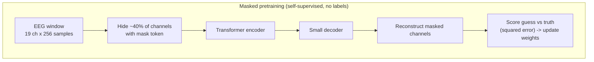
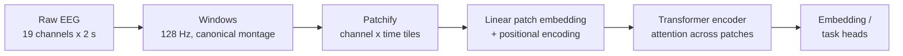
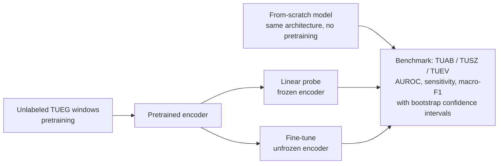
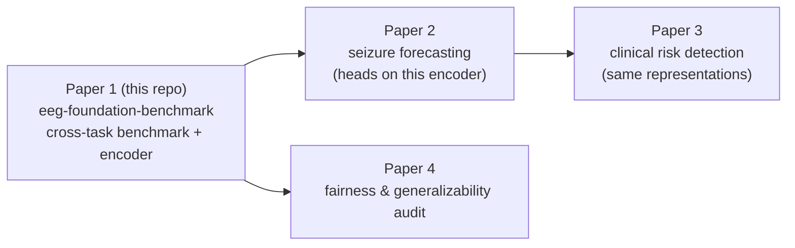

# Extended Introduction: EEG and Foundation Models, Built Up From Scratch

**Who this is for:** anyone — no neuroscience, no signal processing, no
machine-learning background assumed. Every idea below is first shown on a
tiny concrete example you can verify with pencil and paper, then explained
in plain words, and only then given its technical name as a shorthand.
This is a companion to the more technical
[Introduction](INTRODUCTION.md), which holds the formal background,
research questions, and the references cited in brackets below.

**New in this version:** for each core concept we now offer **several
independent mathematical doors** — sets, graphs, counting-based
information theory, geometry, transition tables, and frequency-count
probability. None of them require calculus or Newtonian mechanics. Pick
whichever matches your intuition; they all arrive at the same concept.

**Concept figure:** the pipeline of this repo — raw clinical EEG →
preprocessing → self-supervised transformer encoder → TUAB/TUSZ/TUEV tasks
under one benchmark harness — rendered faithfully in Mermaid at
[figures/concept_figure.md](figures/concept_figure.md). *(A publication-style
PNG was generated but could not be committed with the current text-only
tooling; the Mermaid figure depicts the identical pipeline.)*

---

## Start here: the math toolkit from zero

Everything below uses only these ideas. Each is defined in plain words
with a tiny example; the formal symbol is just shorthand for the words.

- **Variable** — a letter that stands in for a number we don't want to
  fix yet. If we write "spikiness = 7," the word (or the letter $x$) is
  the variable and 7 is its value.
- **Function** — a machine that turns one number into another by a fixed
  rule. Written $f(x)$: put in $x$, get out $f(x)$. Example: if
  $f(x) = 2x$, then $f(3) = 6$.
- **Vector / point** — a short list of numbers treated as one object,
  read as coordinates of a point. The window $(0, 3, 0)$ is a vector of
  length 3, i.e. the point 0 right, 3 up, 0 deep.
- **Distance** — how far apart two points are, computed by subtracting
  matching coordinates, squaring, adding, and taking the square root.
  Between $(0,3,0)$ and $(0,2,0)$: $\sqrt{0^2 + 1^2 + 0^2} = 1$.
- **Probability as a fraction of cases** — count the cases where the
  thing happens, divide by all cases. If 18 of 20 pairs are won, the
  win probability is $18/20 = 0.9$.
- **log2 (logarithm base 2)** — "how many times do I halve to reach 1?"
  or equivalently "how many yes/no questions to find one option among
  $n$?" $\log_2(4) = 2$ because 4 options need exactly 2 questions.
- **Entropy** — the average number of yes/no questions needed to pin
  down a random symbol, in bits. Uniform over 4 states costs
  $\log_2(4) = 2$ bits; a fully predictable symbol costs 0 bits.
- **Mutual information** — how many of the questions about one channel
  are already answered by knowing another. Identical channels: all of
  them (1 bit for a coin-flip channel); independent channels: 0 bits.
- **Mean squared error (MSE)** — the average of the squared gaps between
  guesses and truths; squaring makes misses positive and big misses
  count extra. Guesses 2, 5 against truths 1, 5: MSE $= (1^2 + 0^2)/2 = 0.5$.
- **Sensitivity** — of all truly abnormal cases, the fraction we caught:
  $\mathrm{TP}/(\mathrm{TP}+\mathrm{FN})$. Catch 18 of 20: sensitivity $= 0.9$.
- **Specificity** — of all truly normal cases, the fraction we left
  alone: $\mathrm{TN}/(\mathrm{TN}+\mathrm{FP})$. Spare 77 of 80: specificity $\approx 0.96$.
- **Precision** — of all the cases we flagged, the fraction that were
  real: $\mathrm{TP}/(\mathrm{TP}+\mathrm{FP})$. 18 real out of 21 flags: precision $\approx 0.86$.
- **AUROC** — the probability that a randomly chosen abnormal case gets
  a higher score than a randomly chosen normal one; count winning pairs
  and divide by all pairs. 18 wins of 20 pairs: AUROC $= 0.9$.
- **Weighted average / mixing weights** — an average where some items
  count more, with weights that sum to 1. Weights 0.5/0.5 on 2 and 4
  give 3; weights 0.9/0.1 give 2.2.

---

## Step 0: A wiggly line of eight numbers

Forget brains for a moment. Here is a complete "signal":

```
time:    1   2   3   4   5   6   7   8
value:   0   3   0  -3   0   3   0  -3
```

Plot those eight numbers as dots and connect them, and you get a little
wiggle: up, down, up, down. That is everything a signal *is* — a list of
numbers, one per moment in time. An EEG recording is exactly this, except
the list is longer (hundreds of numbers per second) and there are several
lists at once, one per electrode glued to the scalp.

Three things you can do with any wiggly line, shown on our eight numbers:

1. **How fast does it wiggle?** Our line repeats its up-down pattern
   every 4 steps (0, 3, 0, −3, then again). If the 8 steps span one
   second, the pattern repeats twice per second. *"Repeats per second"*
   is all the word **frequency** means, and its unit, "per second", is
   called **Hertz (Hz)**. Our toy signal is a 2 Hz wiggle.
2. **Where in the cycle are we?** A wiggle has phases of its journey:
   climbing (step 1→2), falling (step 2→4), climbing again. Saying "the
   two channels reach their peak at the same moment" versus "one peaks
   while the other bottoms out" is all the word **phase** means. Phase
   is just "where in the wiggle-cycle," like where the hour hand is on
   a clock.
3. **Keep the slow wiggle, drop the fast jitter.** Suppose our line had
   instead been `0, 3.2, -0.1, -3.1, 0.2, 2.9, -0.2, -2.8` — the same
   slow wiggle plus small jitter. Averaging neighbors smooths the jitter
   away and keeps the slow wiggle. That smoothing is the simplest case
   of what engineers call **filtering**: a recipe for keeping the wiggle
   speeds you care about and suppressing the rest. Nothing more mystical
   than weighted averaging, done systematically.

That is the entire signal-processing vocabulary this project needs:
frequency (how fast), phase (where in the cycle), filtering (keep some
speeds, drop others).

### The many roads to an EEG signal

The same wiggly line can be seen through several formal windows. Each is
complete on its own; together they triangulate what "a signal" is.

**Road 1 — Automata: a signal as a walk through a transition table.**
Discretize the signal into a few named states — say L (low, value < 0),
M (middle, = 0), H (high, > 0) — and record which state follows which.
Our eight numbers become the state walk M, H, M, L, M, H, M, L, and its
transition table is: M→{H half the time, L half the time}, H→{M always},
L→{M always}. A rhythm is then nothing but a short cycle in this table:
M→H→M→L→M… loops with period 4, which *is* the 2 Hz frequency, with no
waves or trigonometry anywhere. *Worked example:* the walk M,H,M,L has 4
transitions; H appears once and always goes to M, so row H of the table
reads "M with count 1". *What it buys you:* rhythms become finite,
countable objects you can diff between patients ("which transitions are
missing?"). *What it costs you:* amplitude detail is thrown away when you
bin values into L/M/H; two very different waves can share one table.

**Road 2 — Information theory by counting: a signal as a stream of
surprises.** Ask how many yes/no questions you need to guess the next
state. If the next symbol is one of 4 equally likely states, you need
log2(4) = 2 questions; that number of questions *is* the entropy in bits.
In symbols, for outcome probabilities $p_1, \dots, p_n$:

$$H = -\sum_i p_i \log_2 p_i$$

Check it on the uniform 4-state case: each $p_i = 1/4$ and $\log_2(1/4) = -2$, so $H = -4 \times (1/4) \times (-2) = 2$ bits — exactly the counting answer.
*Worked example:* suppose a channel cycles deterministically
M,H,M,L,M,H,M,L — once you know the current state, the next is certain, so
it costs 0 extra questions: entropy of the next symbol given the current
one is 0 bits. A jittery channel that picks among 4 states uniformly
costs 2 bits every step. *What it buys you:* "predictable" versus "noisy"
becomes a number you can compute by counting a small table, and seizure
rhythms (rigid, low-entropy) separate from background (rich, high-entropy)
on this axis alone. *What it costs you:* entropy ignores *order* — a
sorted list and a shuffled list of the same symbols have the same entropy;
you need the conditional version (given the previous symbol) to see
rhythm.

**Road 3 — Geometry: an epoch as a point, similarity as distance.** Take
a short window of a channel and read its values as coordinates: the window
(0, 3, 0) is the point (0,3,0) in 3-D space. Two windows that wiggle alike
land at nearby points; "similar signals" = "small distance." *Worked
example:* distance between A = (0,3,0) and B = (0,2,0) is
sqrt((0-0)² + (3-2)² + (0-0)²) = 1, while A to C = (0,-3,0) is
sqrt(0 + 36 + 0) = 6. In symbols, the Euclidean distance is

$$d(A, B) = \sqrt{\sum_i (A_i - B_i)^2}$$

— subtract, square, add, square-root — and it reproduces both numbers
above — so the shape-aware statement "B is closer to A than C is" is one
subtraction per coordinate. *What it buys you:*
clustering, nearest-neighbor classification, and the "embedding space" of
Step 5 all become literally points on a map. *What it costs you:* raw
distance is sensitive to shifting and scaling — slide a wave one step in
time and the point jumps even though the shape is unchanged.

**Road 4 — Graph theory: a montage as a network of electrodes.** The 19
electrodes are nodes; draw an edge between two nodes when their signals
rise and fall together (or when they sit next to each other on the scalp).
*Worked example:* four electrodes a, b, c, d on a line with edges
a–b, b–c, c–d: node b has 2 neighbors, a has 1; the number of edges on the
shortest path from a to d is 3, and removing node c cuts the graph into
{a,b} and {d}. *What it buys you:* "activity spreads from the left
temporal region" becomes a statement about paths and neighborhoods; later,
masking channels (Step 5) becomes "hide a node, predict it from its
neighborhood." *What it costs you:* the graph says nothing by itself
about *when* things happen — it is a static summary of who talks to whom.

## Step 1: What EEG actually is

Your brain runs on electricity. When large groups of neurons fire in
rhythm together, their combined electrical field leaks through the skull
and can be picked up by small metal discs (electrodes) on the scalp.
**Electroencephalography (EEG)** is the act of recording those voltages
over time — typically 19–25 electrodes, each producing one wiggly line
sampled hundreds of times per second.

A useful analogy: **EEG is like listening to a stadium crowd from outside
the stadium.** You can't hear individual fans (single neurons), but you
can hear the crowd roar, go quiet, or chant in rhythm. A trained listener
learns a lot about the game from those collective patterns — and a trained
neurologist, or a computer model, learns a lot about the brain.

Brains produce rhythms at characteristic speeds, and using Step 0's
vocabulary we can name them:

| Band | Frequency | Plain-English meaning |
|---|---|---|
| **Delta** (0.5–4 Hz) | slowest wiggles | Deep sleep; large slow swells. |
| **Theta** (4–8 Hz) | slow | Drowsiness, daydreaming. |
| **Alpha** (8–13 Hz) | medium | Relaxed wakefulness — close your eyes and alpha appears at the back of the head; open them and it vanishes. (Our public demo classifies exactly this!) |
| **Beta** (13–30 Hz) | fast | Alert, focused thinking. |

A **seizure** is an electrical storm: neurons start firing together in an
abnormally strong, self-sustaining rhythm. On paper it looks like rhythmic
spikes or waves that grow, evolve, and spread across electrodes over tens
of seconds — visibly different from the background, which is why a machine
might learn to spot it. In Road 1's language: the transition table locks
into a tight, low-entropy cycle and then the cycle spreads along the
electrode graph of Road 4.

## Step 2: Why this needs automating

- **Experts are scarce.** Reading EEGs takes years of fellowship
  training, and there are far too few specialists worldwide.
- **Recordings are long.** A single study can last minutes to days;
  reviewing it line by line takes hours.
- **Experts disagree.** Even trained readers only modestly agree on
  borderline cases.

Many recordings are read late or never. Even partial automation —
triage, flagging suspicious stretches — would free scarce expert time.

## Step 3: Learning from examples — a tiny classifier by hand

Before "foundation models," watch a classifier be born. Suppose we measure
one number per EEG window — how "spiky" it is — for eight windows that a
doctor labeled:

```
spikiness:  1   2   2   3   6   7   8   9
label:      N   N   N   N   A   A   A   A     (N=normal, A=abnormal)
```

A child could spot the rule: *"if spikiness > 4, say abnormal."* That rule
scores 8/8. A **classifier** is nothing but such a rule; **training** is
nothing but finding the rule from labeled examples; **from scratch** means
the rule-finder starts knowing nothing.

Real EEG windows can't be boiled down to one hand-picked number by a human
— the rule must discover for itself *which* aspects of the wiggles matter.
That is what "deep learning" adds: the rule's internal ingredients (which
features to compute) are also learned from examples [2, 13].

### The many roads to a classifier

**Road 1 — Sets and logic: a classifier as a membership rule.** The
universe is all EEG windows; the rule carves out a subset S = {windows
with spikiness > 4} and declares membership = abnormal. *Worked example:*
from the eight windows above, S = {6, 7, 8, 9} and the labeled-abnormal
set is {6, 7, 8, 9}; the two sets are equal, so the rule is perfect, and
"errors" are exactly the set differences (members of one set missing from
the other). *What it buys you:* mistakes decompose cleanly — false alarms
are S minus the truth, misses are the truth minus S — and combining rules
is just AND/OR of sets. *What it costs you:* a set has hard borders; it
cannot express "barely abnormal," which real triage needs.

**Road 2 — Geometry: a classifier as a fence drawn on a map.** Give each
window two numbers, say (spikiness, slowing), so it becomes a point; the
classifier is a line separating regions. *Worked example:* points
(1,1), (2,2), (3,1) are normal and (6,5), (7,6), (8,6) abnormal; the
vertical line "spikiness = 4.5" puts all normals on the left and all
abnormals on the right — a perfect fence found by eyeballing a plot.
*What it buys you:* "training" becomes sliding and tilting a fence until
few points are on the wrong side, which is exactly how linear probes
(Step 5) work in the embedding space. *What it costs you:* when no
straight fence separates the clouds you need many fences (that is all a
deep network is), and the picture gets hard to draw beyond three
dimensions.

**Road 3 — Probability as frequencies: a classifier as a counted
2×2 table.** Apply the rule to 100 windows and just count:

```
                    truly abnormal   truly normal
rule says abnormal       18               3
rule says normal          2              77
```

Sensitivity ("of the truly abnormal, how many did we catch?") is
18/20 = 90%; specificity is 77/80 ≈ 96%; precision ("of our flags, how
many were real?") is 18/21 ≈ 86%. With TP = true positives,
TN = true negatives, FP = false alarms, FN = misses, these are:

$$\text{sensitivity} = \frac{\mathrm{TP}}{\mathrm{TP} + \mathrm{FN}} = \frac{18}{18 + 2} = 0.90, \qquad
\text{specificity} = \frac{\mathrm{TN}}{\mathrm{TN} + \mathrm{FP}} = \frac{77}{77 + 3} \approx 0.96, \qquad
\text{precision} = \frac{\mathrm{TP}}{\mathrm{TP} + \mathrm{FP}} = \frac{18}{18 + 3} \approx 0.86$$

Every detection metric in this repo is
a ratio of cells in such a table — no integrals involved. *Worked
example:* raising the threshold moves some of the 18 into the 2 and some
of the 3 into the 77: one row shifts into the other, and every metric is
recomputed by division. *What it buys you:* honest, bedside-meaningful
numbers a clinician can audit. *What it costs you:* the table depends on
how common abnormality is in your sample — the same rule gets a different
precision when abnormal windows are rare.

## Step 4: The catch — small data doesn't travel

The classic EEG recipe was: collect ~100 labeled recordings at one
hospital, train from scratch, hope. These models usually fail at other
hospitals and on other tasks — the reviews cited in the formal
introduction document this pattern [3, 4]. The model memorizes one
hospital's quirks instead of brain-wave grammar.

## Step 5: Self-supervised pretraining — the fill-in-the-blank trick

Here is the key idea, again first as a toy. Take our eight-number wiggle
`0, 3, 0, -3, ?, 3, 0, -3` and hide one number behind `?`. You can guess
it: 0, because you noticed the repeating pattern. **Hiding a piece and
learning to fill it in forces you to understand the pattern's structure**
— no teacher needed, because the hidden piece itself is the answer key.

Scale that idea up:

1. Take a short EEG window (ours are 2 seconds: 19 channels × 256 samples
   after resampling to 128 Hz).
2. Chop it into small patches (channel × time tiles).
3. **Hide entire channels** — replace them with a placeholder (we mask
   ~40% of channels).
4. Ask the model to reconstruct the hidden waveforms from the visible
   ones, and score the guess against the truth (the average squared gap
   between guessed and true numbers — "mean squared error" — lower is
   better). In symbols, for guesses $\hat{x}_i$ and truths $x_i$:

   $$\mathrm{MSE} = \frac{1}{n} \sum_{i=1}^{n} (\hat{x}_i - x_i)^2$$

   Guessing 2, 5, 8 when the truth is 1, 5, 6 gives $((2-1)^2 + 0^2 + (8-6)^2)/3 = (1 + 0 + 4)/3 \approx 1.67$.

To succeed, the model must learn real structure: which electrodes are
neighbors, how rhythms propagate, what plausible EEG looks like. We mask
whole channels rather than random patches for a reason: patch masking lets
the model cheat by interpolating within a channel; channel masking forces
it to learn **cross-channel** relationships (`src/eegfm/models.py`,
`MaskedReconstructionModel`). A sibling objective, **contrastive
learning**, teaches the model that two views of the same recording should
end up with similar internal representations, and views of different
recordings dissimilar — "tell apart what belongs together."

This is **self-supervised learning (SSL)**: the labels are manufactured
from the data itself, so 60,000 unlabeled recordings become 60,000 free
lessons. A model pretrained this way is a **foundation model**: learn the
grammar of brain waves first, then adapt to a specific task with a modest
number of labeled examples — either training only a small readout layer on
top (**linear probe**) or gently adjusting the whole network
(**fine-tuning**). This is the paradigm that transformed language
modeling [5], adapted to EEG by BENDr, BIOT, LaBraM, EEGPT, and
CBraMod [6–9, 14].

Analogy: **learn English by reading all of Wikipedia, then learn medical
report writing from a few dozen examples.** The second step is easy
because the first taught grammar and facts. Without it, a few dozen
examples could never teach a language *and* medicine at once.

### The many roads to learning without labels

**Road 1 — Automata: prediction as memorizing a transition table.**
Filling in `?` in `0, 3, 0, -3, ?, 3, 0, -3` is possible because the
state walk M,H,M,L,?,M,H,M,L obeys a nearly deterministic table: L is
always followed by M. *Worked example:* from the visible transitions,
row L of the table reads "next = M, count 1/1", so the masked symbol
after L is predicted M with confidence 1 — the fill-in is a table lookup,
and *learning* is tallying this table from many recordings. *What it buys
you:* "the model learned the grammar of EEG" becomes concrete — it
learned which states follow which, with counts. *What it costs you:* a
one-step table misses long-range structure (the table sees only the last
state, not the last minute), which is why real models condition on many
patches at once.

**Road 2 — Information theory by counting: pretraining as making
channels answer questions about each other.** Mutual information asks:
how many yes/no questions about channel X does knowing channel Y answer?
In symbols, it is the entropy of X minus the entropy that remains once Y
is known:

$$I(X; Y) = H(X) - H(X \mid Y)$$

— "questions about X" minus "questions still left after hearing Y."
*Worked example:* two channels each flip a fair coin independently —
knowing Y answers 0 of the 1 question about X (mutual information 0
bits). Now make them identical copies: Y's value answers the only
question about X (mutual information 1 bit). Neighboring electrodes sit
in between — say Y predicts X in 3 of 4 cases, so Y answers roughly
log2(4/3) ≈ 0.4 questions' worth on average. Masked reconstruction works
precisely when this number is high: hidden channels are guessable from
visible ones. *What it buys you:* a principled reason *why* 60,000
unlabeled recordings teach structure — redundancy is free supervision.
*What it costs you:* counting-based estimates need lots of data to be
trustworthy, and high mutual information does not guarantee the
*clinically relevant* bits are the shared ones.

**Road 3 — Graph theory: masking as node prediction on the electrode
graph.** On the scalp graph (Road 4 of the signal section), masking a
channel means erasing a node's value and asking its neighborhood to vote
on it. *Worked example:* on the path graph a–b–c–d, hide node b; its
neighbors are a and c, and if adjacent electrodes correlate, a guess like
"average of the neighbors" — (value(a) + value(c))/2, e.g. (2 + 4)/2 = 3
when a = 2 and c = 4 — is already decent; learning refines the vote
weights. *What it buys you:* explains in one picture why whole-channel
masking beats patch masking — within-channel neighbors are too easy, the
lesson only bites when the answer must come *across edges*. *What it
costs you:* the fixed scalp graph ignores that real coupling changes over
time and with brain state.

**Road 4 — Geometry: embeddings as a map where meaning is location.**
The encoder turns each window into a point; pretraining pushes points of
similar windows together and dissimilar ones apart (the contrastive
objective is literally "move these two points closer, those two apart").
*Worked example:* two views of one recording land at (1,1) and (1.2,0.9)
— distance sqrt(0.04 + 0.01) ≈ 0.22 — while a different recording sits at
(4,4), distance ≈ 4.2; training shrinks the first gap and grows the
second. A linear probe (Step 3's fence) then works because abnormal and
normal windows occupy different neighborhoods of this map. *What it buys
you:* "transfer learning" becomes visible — the same map serves TUAB,
TUSZ, and TUEV because the geography is task-independent. *What it costs
you:* distances in the map have no units or direct clinical meaning, and
a good-looking map can still hide a bad neighborhood.



The **transformer encoder** in the middle is the engine: it processes all
patches at once and lets each patch "look at" the others when building its
representation (an operation called *attention*). You only need the
intuition: every piece of the signal gets to ask every other piece, "are
you relevant to understanding me?" In table language (Step 3's weight
tables, Road 2): attention is a mixing table whose rows sum to 1 — each
patch's new value is a weighted average of the others, with weights
learned from the data. In symbols, patch $i$ updates as

$$x_i^{\text{new}} = \sum_j w_{ij} \, x_j, \qquad \sum_j w_{ij} = 1$$

— e.g. weights 0.5/0.5 mix values 2 and 4 into 3, and training is just
learning which $w_{ij}$ help reconstruct the masked channels.



## Step 6: Scoring a classifier — AUROC from nine patients

Metrics, too, start with a tiny example. A triage model gives each of
9 EEGs an "abnormality score":

```
score:    .10  .20  .30  .45  .55  .70  .80  .90  .95
truth:     N    N    N    A    N    A    A    A    A
```

(4 abnormal, 5 normal.) Now ask: pick one truly-abnormal EEG and one
truly-normal EEG at random — what are the odds the abnormal one got the
higher score? Count all 4×5 = 20 pairs: the abnormal EEG wins in 18 of
them, ties once, loses once. So the model ranks correctly about 90% of the
time. That single number is the **AUROC** ("area under the ROC curve"):
the probability that a random positive is ranked above a random negative.
In symbols, with $S_{+}$ a random abnormal score and $S_{-}$ a random
normal one:

$$\mathrm{AUROC} = P\left(S_{+} > S_{-}\right)$$

and our 18 winning pairs out of 20 are the counted estimate $18/20 = 0.9$.
0.5 is coin-flip, 1.0 is perfect. It is popular because it summarizes
ranking quality at every possible threshold at once — without committing
to where you draw the "flag this" line. A sibling metric, **AUPRC**, is
preferred when positives are rare: it tracks, among the windows you flag,
how many are truly positive and how many positives you catch.

### The many roads to evaluating a model

**Road 1 — Probability as frequencies: the 2×2 table at one threshold.**
Pick a threshold, say 0.5, and count. The nine EEGs give: flagged (score
≥ 0.5) = {.55,.70,.80,.90,.95} of which 4 truly abnormal and 1 normal;
unflagged = 4 normals. So sensitivity = 4/5 = 80%, specificity = 4/4 =
100%, precision = 4/5 = 80%. Every "at this threshold" metric is a ratio
of these four counts. *What it buys you:* complete auditability — nothing
is hidden inside a curve. *What it costs you:* it grades the model only
at one operating point; move the threshold and the grade changes.

**Road 2 — Counting pairs: AUROC as a tournament.** The 18/20 count above
*is* the whole idea: every abnormal EEG plays a match against every
normal EEG, and AUROC is the win rate. *Worked example:* the abnormal
with score .45 plays 5 normals and beats all 5; the one with .55 beats 4
normals and loses to none below it but the normal at .55 doesn't exist —
check the table: it wins 5, the .70 wins 5, .80 wins 5, .90 wins 5,
losing only the single counted tie/loss pair in the full 20-match
schedule — win rate 18/20 = 0.90. *What it buys you:* a threshold-free
grade computed by pure counting. *What it costs you:* a tournament can
look great while precision is poor when abnormals are rare — winning
against 999 normals still leaves false alarms.

**Road 3 — Geometry: the score axis as a number line with overlap.**
Plot each class's scores as stacks of dots on one line. AUROC measures
how little the two stacks interleave; thresholding is picking a cut point
on the line. *Worked example:* normals pile up at .10–.45, abnormals at
.45–.95, and only the .45/.55 region overlaps — one glance shows why the
tournament win rate is 90%. *What it buys you:* you can *see* class
overlap, and you can see where rare positives would get swamped. *What it
costs you:* one line per score; models with several outputs need one
picture each.

## Step 7: A fair race — the benchmark

Pretrained foundation models [6–9, 14] each reported good numbers, but on
different windows, splits, and baselines — like runners racing on
different tracks. This repository builds one shared track: the TUH
benchmarks, under identical preprocessing, fixed subject-disjoint splits,
and identical scoring, in an MLSPred-Bench-style harness.



The benchmark (`src/eegfm/benchmark.py`) compares a pretrained encoder
against an **identical architecture trained from scratch** on the same
labeled split — this isolates the value of pretraining itself. On our
synthetic phase-coupling benchmark the difference is dramatic (pretrained
probe AUROC 0.97–1.00 vs from-scratch 0.47–0.58, i.e., chance); on the
small real-data demo the honest answer is more nuanced — see
[METHODS.md](METHODS.md). Confidence intervals come from the **bootstrap**:
re-draw the test set with replacement many times, re-score each time, and
report the spread — so differences aren't confused with luck.

### The many roads to "is this difference real?"

**Road 1 — Probability as frequencies: the bootstrap as recounting with
a tilted urn.** Put the 9 test EEGs in an urn; draw 9 *with replacement*
(some twice, some never), recompute AUROC, repeat 1,000 times, and look at
the spread of the 1,000 answers. *Worked example:* if redrawn AUROCs land
between 0.83 and 1.00 in 950 of 1,000 draws, that interval is the honest
uncertainty — computed purely by recounting, no formulas. *What it buys
you:* a confidence statement that needs no probability theory beyond
counting draws. *What it costs you:* the urn only contains what the test
set contains — a biased test set gives precisely wrong intervals.

**Road 2 — Game theory: evaluation as an adversary picking splits.**
Imagine an opponent who, after seeing your model, chooses the test split
that makes it look worst; your score is the minimum over their moves.
*Worked example:* with two possible splits giving AUROC 0.90 and 0.71,
the adversary picks 0.71 — so you report and optimize the worst case, not
the sunny one. Subject-disjoint splits are a real-world version of this:
the adversary is "new patients the model has never seen." *What it buys
you:* explains *why* fixed, leakage-free splits are the heart of the
benchmark, not bureaucracy. *What it costs you:* worst-case thinking is
pessimistic; typical deployment may be kinder than the adversary.

**Road 3 — Set theory: leakage as forbidden intersection.** Train set and
test set must be disjoint *as sets of patients*, not just recordings.
*Worked example:* patients {p1..p6} with p1..p4 in train and p5,p6 in
test — if one of p4's recordings slips into test, the intersection
{p4} is non-empty and the measured AUROC is contaminated. Checking
leakage = computing an intersection and demanding it be empty. *What it
buys you:* a one-line, mechanical audit (we run exactly this check).
*What it costs you:* sets catch *identity* leakage, not subtler kinds
(same scanner settings, same referral patterns shared across splits).

## Step 8: The data

The **Temple University Hospital (TUH) EEG Corpus** is the largest public
collection of clinical EEG: 60,000+ recordings from 15,000+ patients
collected in routine hospital care [1]. Its pieces:

- **TUEG** — the full unlabeled archive (for pretraining)
- **TUAB** — normal vs. abnormal labels [10, 12]
- **TUSZ** — expert seizure annotations [11]
- **TUEV** — six fine-grained event types [1]

Access is free for research but requires a signed Data Use Agreement with
Temple University — see [DATA_ACCESS.md](DATA_ACCESS.md). Because approval
takes days to weeks, this repo is developed and tested on synthetic EEG
plus a credential-free public dataset (PhysioNet eegmmidb).

## The four-paper series

This repo is **Paper 1** of four. It builds the encoder and evaluation
harness the later papers reuse.



## Choosing your road

- If you think in **code and state machines**, take the automata road:
  signals are transition tables, pretraining is learning the table.
- If you think in **counting and surprises**, take the information-theory
  road: predictability is "how many yes/no questions remain."
- If you think in **pictures and maps**, take the geometry road: windows
  are points, classifiers are fences, embeddings are geography.
- If you think in **who is connected to whom**, take the graph road:
  electrodes are nodes and masking is neighborhood voting.
- If you think in **frequencies and real-world counts**, take the 2×2
  table road: every metric is a ratio of cases you can audit by hand.
- If you think in **adversaries and guarantees**, take the game/set road:
  a benchmark is a rule-set that blocks cheating moves like leakage.

## Learn more (verified links)

- [Electroencephalography (Wikipedia)](https://en.wikipedia.org/wiki/Electroencephalography) — a thorough, readable tour of what EEG measures and how it is recorded.
- [Entropy (information theory) (Wikipedia)](https://en.wikipedia.org/wiki/Entropy_(information_theory)) — Shannon entropy from counting questions to the full formula, with worked coin-flip examples.
- [Receiver operating characteristic (Wikipedia)](https://en.wikipedia.org/wiki/Receiver_operating_characteristic) — ROC curves and why the area under them equals the pairwise win probability.
- [Calibration (statistics) (Wikipedia)](https://en.wikipedia.org/wiki/Calibration_(statistics)) — what it means for predicted probabilities like "70%" to actually happen 70% of the time.
- [Self-supervised learning (Wikipedia)](https://en.wikipedia.org/wiki/Self-supervised_learning) — the masked / contrastive paradigm behind the foundation models in this repo.
- [3Blue1Brown: Neural Networks](https://www.3blue1brown.com/topics/neural-networks) — beautifully animated, gentle visual lessons on how neural networks and training actually work.

## Where to go next

- [INTRODUCTION.md](INTRODUCTION.md) — formal background, prior work,
  research questions, and full references [1–14].
- [METHODS.md](METHODS.md) — what is implemented vs. planned, and the
  reasoning and statistics behind our design choices.
- [DATA_ACCESS.md](DATA_ACCESS.md) — how to get TUH corpus access.
