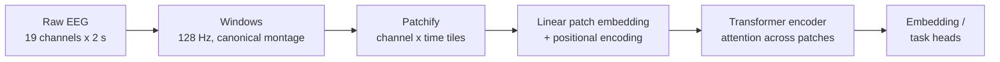
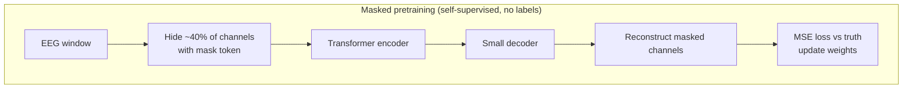
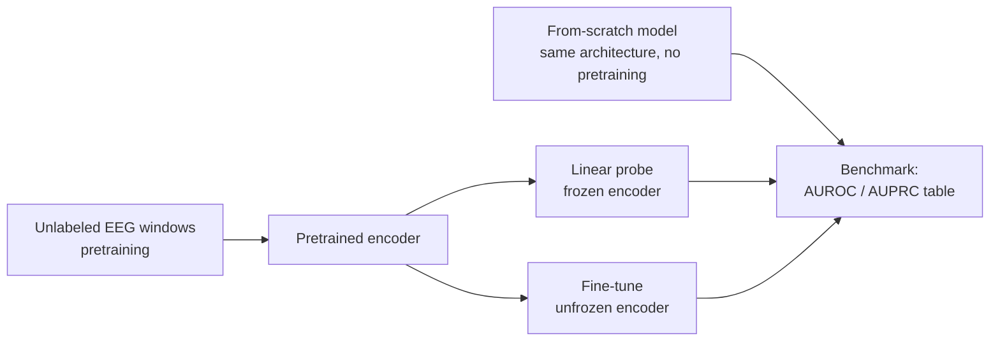
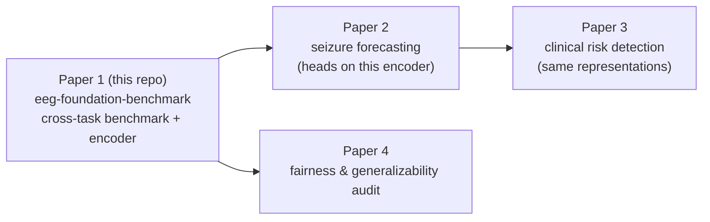

# Extended Introduction: EEG and Foundation Models for Complete Beginners

**Who this is for:** anyone with zero neuroscience and zero machine-learning
background who wants to understand what this repository is doing and why.
No prior knowledge is assumed — every term is explained before we use it.
This is a companion to the more technical
[Introduction](INTRODUCTION.md); that page contains the formal background,
research questions, and references [1–14] cited in brackets below.

---

## What is EEG?

Your brain runs on electricity. Every thought, movement, and sensation
involves millions of neurons firing tiny electrical signals. These signals
are far too weak to measure one neuron at a time from outside the head —
but when large groups of neurons fire in rhythm together, their combined
electrical field leaks through the skull and skin and can be picked up by
small metal discs (electrodes) glued to the scalp.

**Electroencephalography (EEG)** is simply the act of recording those
voltages over time. A standard clinical setup places 19–25 electrodes at
standardized positions (the "10-20 system"), and each electrode produces
one wiggly line: voltage on the vertical axis, time on the horizontal,
sampled hundreds of times per second.

A useful analogy: **EEG is like listening to a stadium crowd from outside
the stadium.** You can't hear any individual fan (a single neuron), but
you can hear the crowd roar when a goal is scored, go quiet in suspense,
or chant in rhythm. Those collective patterns are surprisingly
informative — a trained listener can tell a lot about what's happening
inside. Similarly, a trained neurologist (or, we hope, a computer model)
can tell a lot about the brain's state from scalp recordings.

## Brain waves in plain terms

Brains don't just produce random noise — they produce *rhythms*, and
neuroscientists group them by speed:

| Band | Speed | Plain-English meaning |
|---|---|---|
| **Delta** (0.5–4 Hz) | slowest | Deep sleep, unconscious states; large slow swells. |
| **Theta** (4–8 Hz) | slow | Drowsiness, daydreaming, the edge of sleep. |
| **Alpha** (8–13 Hz) | medium | Relaxed wakefulness. The classic demo: close your eyes and alpha appears at the back of the head; open them and it vanishes. (Our public demo classifies exactly this!) |
| **Beta** (13–30 Hz) | fast | Alert, focused thinking, active concentration. |

"Hz" (Hertz) means cycles per second — how many wiggles fit in one
second. A recording that is mostly slow delta waves looks completely
different to an expert than one full of fast beta chatter.

## What does a seizure look like in EEG?

A **seizure** is an electrical storm: a group of neurons starts firing
together in an abnormally strong, rhythmic, self-sustaining loop. On an
EEG printout, a seizure typically appears as an evolving pattern of
rhythmic spikes or waves that grow in size, speed up or slow down, and
spread across electrodes over tens of seconds — clearly different from
the background activity around it. Seizure detection is one of the key
clinical tasks this project eventually targets (via the TUSZ corpus
described in [Introduction](INTRODUCTION.md) [11]).

## Why reading EEGs is a bottleneck

Here's the problem that motivates everything in this repo:

- **Experts are scarce.** Reading EEGs reliably requires years of
  fellowship training in clinical neurophysiology, and there are far too
  few specialists worldwide [INTRODUCTION, Background].
- **It takes a long time.** A single recording can last minutes to days
  (in epilepsy monitoring units). Reviewing it line by line takes hours.
- **Experts disagree.** Even trained readers only modestly agree with
  each other on borderline cases.

The result: many recordings are read late or never read at all. If a
computer could even just *triage* recordings — flag the suspicious ones,
mark candidate seizures — it would free up scarce expert time. That's
the practical goal.

## What is a "foundation model"?

Traditional machine learning for EEG worked like this: collect a small
labeled dataset (say, 100 recordings marked "normal" or "abnormal"),
train a model from scratch on it, and hope. These models usually fail to
transfer to new hospitals or new tasks — the reviews cited in
[Introduction](INTRODUCTION.md) [3, 4] document this pattern.

The **foundation model** idea broke this deadlock in natural language
processing [5], and it works like this:

1. **Learn general patterns first, without labels.** Train a big model
   on an enormous pile of *unlabeled* data with a task it can grade
   itself on (more on that below). The model absorbs the general
   "grammar" of the domain.
2. **Adapt with a few examples.** Later, to do a specific job, show the
   pretrained model a modest number of labeled examples and either train
   a small readout layer on top (a *linear probe*) or gently adjust the
   whole model (*fine-tuning*).

Analogy: **learn English by reading all of Wikipedia, then learn to
write medical reports from a few dozen examples.** The second step is
easy because the first step taught you grammar, vocabulary, and facts.
Without the first step, a few dozen examples would never be enough to
learn a language *and* medicine at once.

This repository asks: does the same trick work for brain waves? EEG is a
great candidate because unlabeled clinical EEG is abundant, while
expert-labeled EEG is precious.

## Masked pretraining: hide parts, learn to fill in

How do you train a model on unlabeled data? The trick this repo uses is
**masked reconstruction** (in the style of the Masked Autoencoder, MAE):

1. Take a short EEG window (ours are 2 seconds: 19 channels × 256
   samples after resampling to 128 Hz).
2. Chop it into small patches (channel × time tiles).
3. **Hide entire channels** — replace them with a placeholder "mask
   token" (we mask ~40% of channels).
4. Ask the model to reconstruct the hidden channels' waveforms from the
   visible ones. Grade it with mean squared error (MSE) between its
   guess and the truth.

To succeed, the model must learn real structure: which channels are near
each other on the scalp, how rhythms propagate, what a plausible EEG
waveform looks like. We mask whole channels rather than random patches
for a reason spelled out in the code: random patch masking lets the
model cheat by interpolating across time within a channel; channel
masking forces it to learn **cross-channel** relationships
(`src/eegfm/models.py`, `MaskedReconstructionModel`).

## The pipeline: pretrain → fine-tune → benchmark

The benchmark (`src/eegfm/benchmark.py`) compares a pretrained encoder
against an **identical architecture trained from scratch** on the same
labeled split. This isolates the value of pretraining itself. On our
synthetic phase-coupling benchmark the difference is dramatic
(pretrained probe AUROC 0.97–1.00 vs from-scratch 0.47–0.58, i.e.
chance); on the small real-data demo the honest answer is more nuanced —
see [METHODS.md](METHODS.md).

## What is the TUH EEG Corpus?

The **Temple University Hospital (TUH) EEG Corpus** is the largest
publicly available collection of clinical EEG: more than 60,000
recordings from over 15,000 patients, collected during routine hospital
care [1]. It comes in pieces:

- **TUEG** — the full unlabeled archive (for pretraining)
- **TUAB** — normal vs. abnormal labels [10, 12]
- **TUSZ** — expert seizure annotations [11]
- **TUEV** — fine-grained event types [1]

Access is free for research but requires a signed Data Use Agreement
with Temple University — see [DATA_ACCESS.md](DATA_ACCESS.md) for the
step-by-step process. Because the DUA takes days to weeks, this repo is
developed and tested on synthetic EEG plus a credential-free public
dataset (PhysioNet eegmmidb).

## The math, in one sentence each (with links)

We keep the math here minimal on purpose — excellent free explanations
already exist, so we link instead of re-teaching:

- **AUROC** (Area Under the Receiver Operating Characteristic curve):
  "The probability that the model ranks a random positive example higher
  than a random negative one" — 0.5 is coin-flip, 1.0 is perfect.
  [StatQuest: ROC and AUC, Clearly Explained](https://www.youtube.com/watch?v=4jRBRDbJemM)
- **AUPRC** (Area Under the Precision–Recall curve): "Of the windows the
  model flags, how many are truly positive, and how many positives does
  it catch" — the better metric when positives are rare.
  [StatQuest: Precision and Recall](https://www.youtube.com/watch?v=qWfzIYCvBqo)
- **Reconstruction MSE** (mean squared error): "The average squared gap
  between the model's reconstructed waveform and the true one; lower
  means the model learned the signal's structure."
  [Seeing Theory (Brown University)](https://seeing-theory.brown.edu/)
- **Attention** (the transformer's core operation): "Each patch of the
  signal decides which other patches to look at, and how much, when
  building its representation."
  [3Blue1Brown: Attention in transformers](https://www.youtube.com/watch?v=eMlx5fFNoYc)

## The four-paper series

This repo is **Paper 1** of a four-paper series. It builds the encoder
and evaluation harness that the later papers reuse.

## Where to go next

- [INTRODUCTION.md](INTRODUCTION.md) — formal background, prior work,
  research questions, and full references.
- [METHODS.md](METHODS.md) — what is implemented vs. planned, and the
  reasoning (and statistics) behind our design choices.
- [DATA_ACCESS.md](DATA_ACCESS.md) — how to get TUH corpus access.
