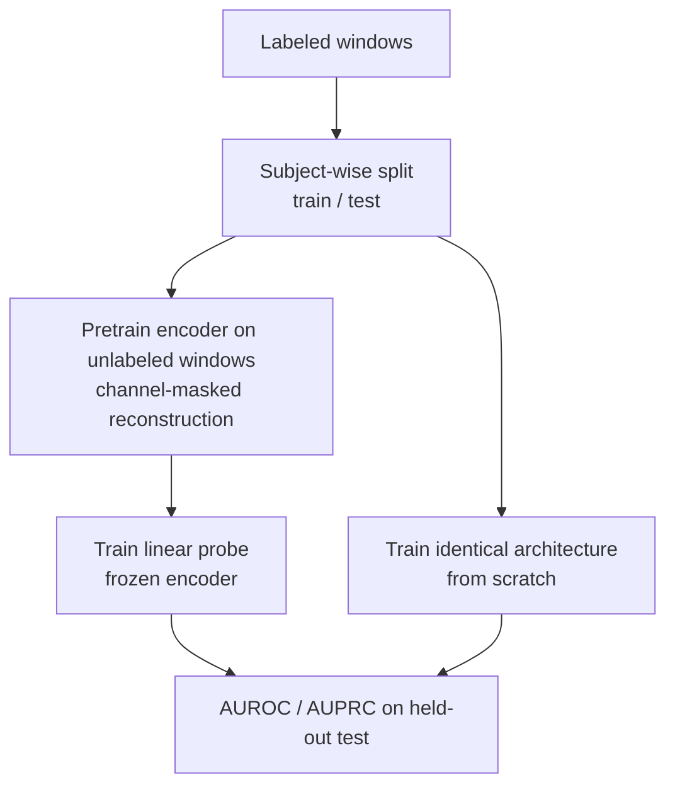
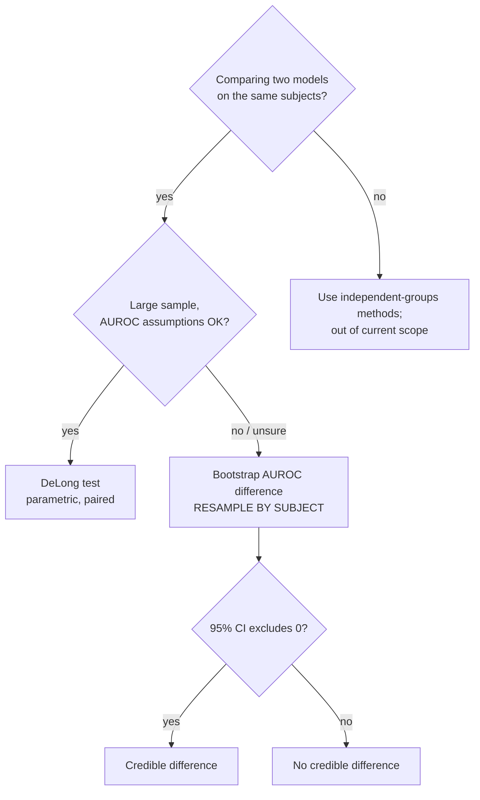

# Methods: What's Done, What's Intended, and Why

**Audience:** new contributors, including those new to data science.
This document separates what the code *actually does today* from what is
*planned*, explains the reasoning behind each design choice, and
introduces the statistics you'll need to read or extend the benchmark.
Read [EXTENDED_INTRODUCTION.md](EXTENDED_INTRODUCTION.md) first if EEG
or machine-learning terms are new to you.

---

## Done

Everything below is implemented in `src/eegfm/` and covered by tests
(`tests/` run on CPU in under a minute, no corpus access needed):

1. **Channel×time patch transformer encoder** (`models.py`). Each EEG
   window (channels × time samples) is cut into patches — contiguous
   time slices of a single channel — linearly embedded, given a learned
   positional encoding per (channel, time-patch) token, and processed by
   a compact `nn.TransformerEncoder`. Two readouts exist: mean-pooled
   embedding (`forward`) and channel-preserving features
   (`forward_channel_features`), the latter keeping *which* channel
   carries *which* pattern available to the classifier.

2. **MAE-style channel-masked pretraining** (`models.py`
   `MaskedReconstructionModel` + `pretrain.py` `pretrain_mae`). Per
   window, ~40% of *channels* are replaced with a learned mask token,
   and a small decoder must reconstruct the masked channels'
   per-patch-standardized waveforms; the loss is MSE on masked patches
   only (AdamW + cosine schedule).

3. **Linear-probe and fine-tune evaluation** (`finetune.py`). A linear
   head on channel-pooled features, trained either with the encoder
   frozen (probe) or unfrozen (fine-tune).

4. **Synthetic benchmark proving pretraining necessity**
   (`simulate.py` + `benchmark.py`). The generator plants
   class-discriminative **cross-channel phase-coupling** patterns.
   Result: pretrained probe AUROC 0.97–1.00 vs from-scratch 0.47–0.58
   (chance). See "Why phase coupling" below.

5. **Real-data pipeline proof on PhysioNet eegmmidb** (`tuh.py`,
   `scripts/`, `reports/`). A credential-free public dataset (ODC-BY)
   exercises the full staging → pretraining → benchmark path: 243
   windows, SSL reconstruction MSE 0.98 → 0.93 over pretraining, and a
   benchmark on the eyes-open vs eyes-closed task
   (`reports/benchmark_results_eegmmidb.csv`):

   | method | AUROC | AUPRC |
   |---|---|---|
   | ssl-pretrained + linear-probe | 0.734 | 0.615 |
   | from-scratch supervised | 0.918 | 0.880 |

   **Honest reading:** on this tiny demo (2 subjects) the from-scratch
   baseline wins. This does *not* contradict the thesis — pretraining
   pays off when unlabeled data is abundant and labeled data is scarce
   relative to task difficulty; a 2-subject alpha-rhythm task is easy
   enough that end-to-end training suffices. We report it as-is because
   the demo exists to validate the *pipeline*, not to claim superiority.

6. **TUEG staging scripts** (`tuh.py`, `scripts/prepare_tueg.py`).
   EDF → canonical 19-channel montage (channel-label normalization),
   resampling, windowing, and an integrity manifest. Raises a clear
   access error when the DUA-gated corpus is absent.

## Intended

Not implemented yet — owner action or open issues:

- **TUEG DUA submission** (owner action; days-to-weeks turnaround — see
  [DATA_ACCESS.md](DATA_ACCESS.md)).
- **Real-corpus pretraining at scale** (issue #4).
- **Cross-task benchmark on TUAB / TUSZ / TUEV** under one harness with
  fixed splits and statistical testing (issue #5).
- **Results package** (issue #2).

## Design decisions, and why

### Why a phase-coupling synthetic task?

The synthetic benchmark is a **mechanistic necessity test**, not a toy
demo. In the generator, class identity is encoded only in the *phase
relationship between channels* — the per-channel power spectrum is
matched across classes. Consequences:

- Any method that looks at channels independently (per-channel power
  features, bag-of-features) is **at chance by construction**.
- A from-scratch model must simultaneously discover cross-channel
  structure *and* the classification boundary from limited labels — it
  fails (AUROC ~0.5).
- A channel-masked pretrained encoder was already *forced* to learn
  cross-channel structure (you cannot reconstruct a hidden channel
  without exploiting other channels), so a linear probe on its frozen
  features succeeds (AUROC ~1.0).

This isolates the claim: **pretraining is necessary when the signal lives
in cross-channel structure.** If pretraining didn't beat from-scratch
here, the whole approach would be in doubt.

### Why linear probe vs fine-tune?

- A **linear probe** (frozen encoder + linear head) answers: "does the
  pretrained representation *already contain* task-relevant, linearly
  readable information?" It's cheap, hard to overfit, and the purest
  measure of representation quality.
- **Fine-tuning** (unfrozen encoder) answers: "what's the best
  achievable accuracy when we're allowed to adapt everything?" It can
  win on harder tasks but risks destroying pretrained structure with
  small labeled sets and makes comparisons murkier.

The benchmark reports the probe as the headline because it isolates
pretraining's contribution; fine-tuning is available in `finetune.py`
and will matter on the harder TUH tasks.

### Why report AUROC *and* AUPRC?

Clinical EEG tasks are **imbalanced** (seizure windows are rare).
AUROC can look optimistic under imbalance because it averages over the
mostly-easy negatives; AUPRC focuses on the positive class and drops
when false alarms pile up. Reporting both makes overclaiming harder.

### Why 128 Hz resampling and a canonical 19-channel montage?

Recordings arrive with different sampling rates, channel counts, and
electrode labels across sites and corpora. A single model needs a single
input format. 128 Hz retains the diagnostically relevant rhythm bands
(delta through beta) while keeping windows small; the canonical 10-20
19-channel set is the lowest common denominator of clinical montages, so
`tuh.py` normalizes channel labels into it. Downstream, every experiment
is comparable because preprocessing is fixed.

### Why 2-second windows?

At 128 Hz, 2 s = 256 samples — long enough to contain several cycles of
alpha (8–13 Hz) so rhythms are identifiable, short enough that a window
usually contains a single state and training sets are large. It's a
standard compromise in the EEG literature; session-scale context is an
explicit research question for later (see INTRODUCTION, RQ4).

## Benchmark flow

## Statistics for newcomers

### Reading AUROC

AUROC is the probability that a random positive window gets a higher
score than a random negative window. 0.5 = chance; 0.7–0.8 = usable;
>0.9 = strong. It is *threshold-free* — it summarizes ranking quality,
not any single operating point.

### Why accuracy is misleading with imbalance

If 1% of windows are seizures, a model that always says "no seizure" is
99% accurate and 0% useful. Accuracy collapses rare-class performance
into the majority class. That's why the benchmark reports AUROC/AUPRC
and why any future TUAB work will use *balanced* accuracy.

### Calibration (concept)

A model can rank well (good AUROC) while its *probabilities* are wrong
— e.g. everything scored 0.6. Calibration asks: "when the model says
70%, is it right 70% of the time?" It matters for triage decisions and
is checked with reliability curves and Brier score; not yet implemented
here, but required before any clinical-facing claim.

### Parametric vs non-parametric: choosing a test

A **parametric** method assumes your data (or its summary) follows a
specific distribution — e.g. the DeLong test assumes a known asymptotic
form for the AUROC's sampling distribution. Advantages: statistically
powerful, fast, closed-form. Risks: wrong assumption → wrong p-values.

A **non-parametric** method makes no distributional assumption — it
uses your data itself: **bootstrap** (resample observations with
replacement to build confidence intervals) or **permutation** (shuffle
labels/assignments to build a null distribution). Advantages: robust,
few assumptions. Costs: more compute, slightly less power, and *you must
resample at the right unit*.

**Decision guide for comparing two models' AUROCs in this project:**

- Same test set, two correlated AUROCs, large i.i.d. sample →
  **DeLong test** (parametric, standard, accounts for correlation).
- Small or structured data, unknown distribution → **bootstrap CIs on
  the AUROC difference**; if the 95% CI excludes 0, the difference is
  credible. This is our default choice rule: *bootstrap unless the
  assumptions of DeLong are clearly met.*
- Asking "could these predictions be swapped at random?" →
  **permutation test** (non-parametric, exact-ish, great for small n).

### Bootstrap by subject, not by window

Windows from the same recording are **not independent** — adjacent 2-s
windows share brain state, artifacts, and electrode quirks. Resampling
windows treats correlated data as independent, producing confidence
intervals that are too narrow (overconfident claims). The correct unit
of resampling is the **subject** (or recording): resample whole subjects
with replacement, keep all their windows together. The same logic drives
splitting (below).

## Leakage and hygiene

- **Subject-wise splits, always.** If windows from one subject appear
  in both train and test, the model can memorize the subject's
  idiosyncrasies instead of learning the task — the classic
  leakage-prone split that the EEG literature is criticized for
  (INTRODUCTION [3, 4]). Planned TUAB/TUSZ evaluation will use
  subject-disjoint folds; the current tiny demo's window-level split is
  acceptable only because it is a pipeline smoke test, and we say so
  wherever we report it.
- **Pretraining/fine-tuning hygiene.** Pretraining must never see test
  labels or test subjects' data if we claim generalization to new
  patients. Unlabeled pretraining windows must be drawn from the
  training side only (`benchmark.py` supports passing `X_unlabeled`
  explicitly to control this).
- **Honest small-demo caveats.** The eegmmidb result (n=2 subjects)
  validates plumbing, not method superiority; the synthetic result
  proves mechanism, not clinical value. Claims will scale up only when
  issues #4/#5 land.
