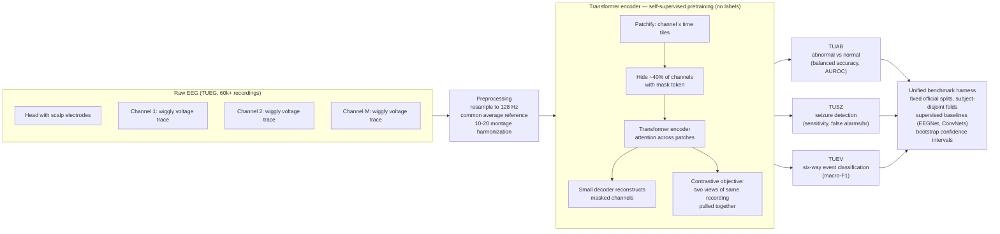

# Concept Figure — Paper 1: A Cross-Task Benchmark for Clinical EEG Foundation Models

*(Binary figure placeholder: the generated 1536x1024 PNG concept figure could not be
committed because the available GitHub tooling only supports text content. This file
provides a faithful Mermaid rendering of the same pipeline. FigForge/NeurIPS-style
layout: raw EEG -> preprocessing -> self-supervised transformer encoder ->
TUAB/TUSZ/TUEV downstream tasks, all over a unified benchmark harness.)*

